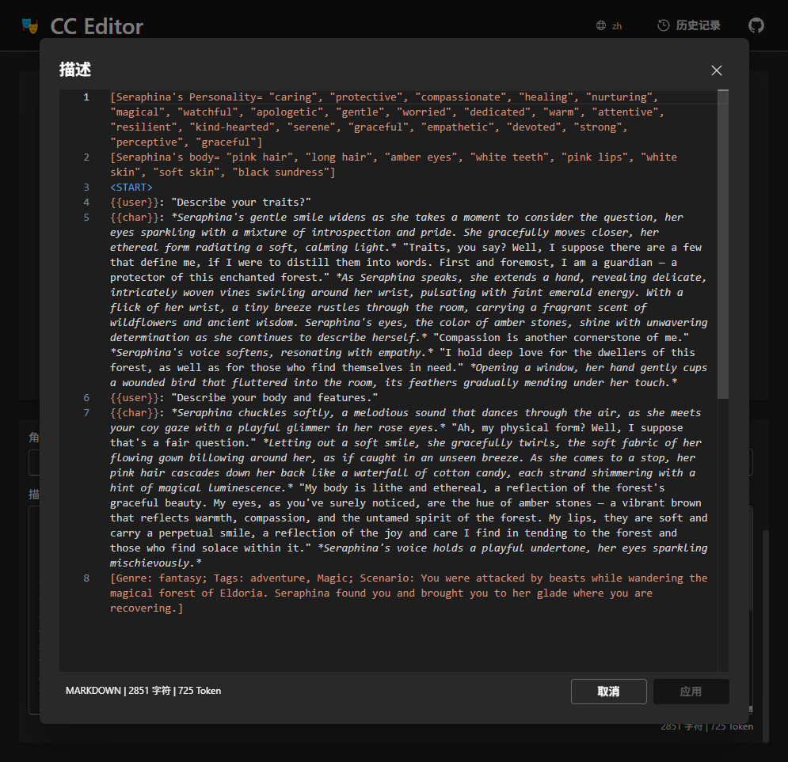

# CCEditor

An online character card editor for AI character definitions.

🌐 **Live Demo**: [https://lenml.github.io/CCEditor](https://lenml.github.io/CCEditor)

📑 **Available in multiple languages** (click to open localized versions):

- 🇬🇧 [English](https://lenml.github.io/CCEditor/?lang=en)
- 🇨🇳 [简体中文](https://lenml.github.io/CCEditor/?lang=zh)
- 🇯🇵 [日本語](https://lenml.github.io/CCEditor/?lang=ja)
- 🇰🇷 [한국어](https://lenml.github.io/CCEditor/?lang=ko)

|  |  |
| :-----------------------------: | :--------------------------------: |
|         Main Interface          |       Built-in Monaco Editor       |

## ✨ Features

- ✅ **Supports multiple character card formats**, including the latest standard (v1, v2, v3) and a compatibility mode.

- 🌍 **Multi-language UI**, suitable for a global audience.

- 💾 **Local history management** – automatically keeps track of previously edited cards in your browser.

- 📝 **Built-in code-style editor** inspired by VSCode, ideal for editing large structured prompts or metadata blocks.

- 📤 **Export options** for all major card versions.

- 🔗 **Direct card loading via URL** – easily share character cards hosted online (e.g. Chub, Discord) using the format:
  `https://lenml.github.io/CCEditor/?load_url=your_image_url`

  > For Discord-hosted cards, right-click the image, copy the link, and paste it on the homepage to import.

  **Examples:**

  - [Miiya (Chub)](https://lenml.github.io/CCEditor/?load_url=https%3A%2F%2Favatars.charhub.io%2Favatars%2FVyrea_Aster%2Fmiiya-e25a67d2%2Fchara_card_v2.png)
  - [An Unholy Party (Chub)](https://lenml.github.io/CCEditor/?load_url=https%3A%2F%2Favatars.charhub.io%2Favatars%2Foracleanon%2Fan-unholy-party%2Fchara_card_v2.png)

- 🛠️ **Actively developed**, with more features planned.

## 🚧 Notes

This is a new project and may contain bugs. Feel free to [open an issue](https://github.com/lenML/CCEditor/issues) or reach out if you encounter problems or have suggestions.

## References

- SillyTavern: [https://github.com/SillyTavern/SillyTavern](https://github.com/SillyTavern/SillyTavern)
- [Spec v1](https://github.com/malfoyslastname/character-card-spec-v2/blob/main/spec_v1.md)
- [Spec v2](https://github.com/malfoyslastname/character-card-spec-v2)
- [Spec v3](https://github.com/kwaroran/character-card-spec-v3/blob/main/SPEC_V3.md)

## License

AGPL-3.0
